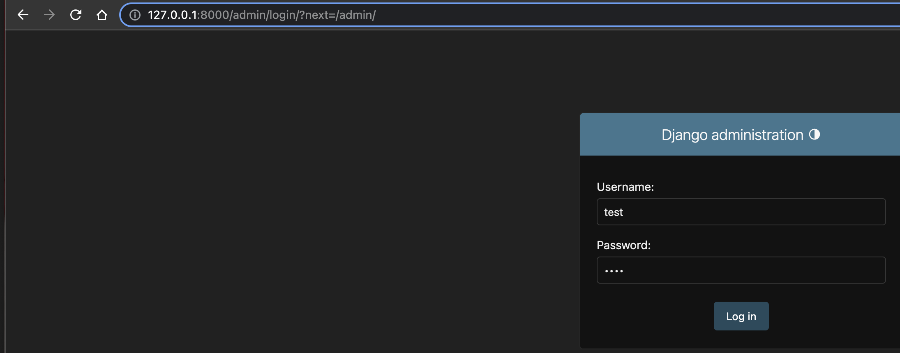
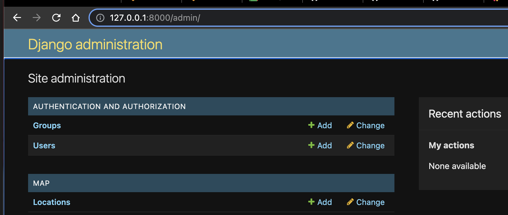
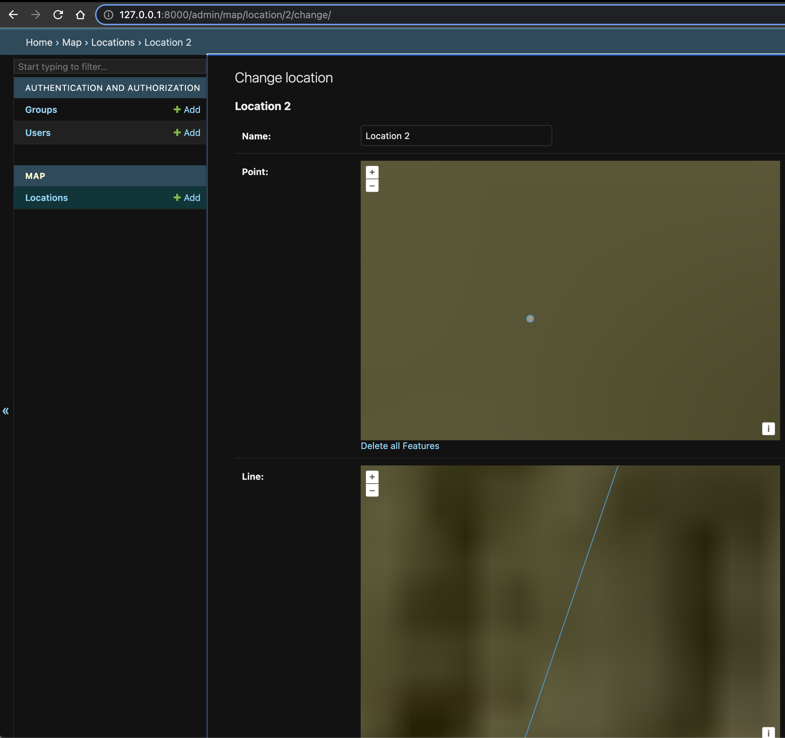
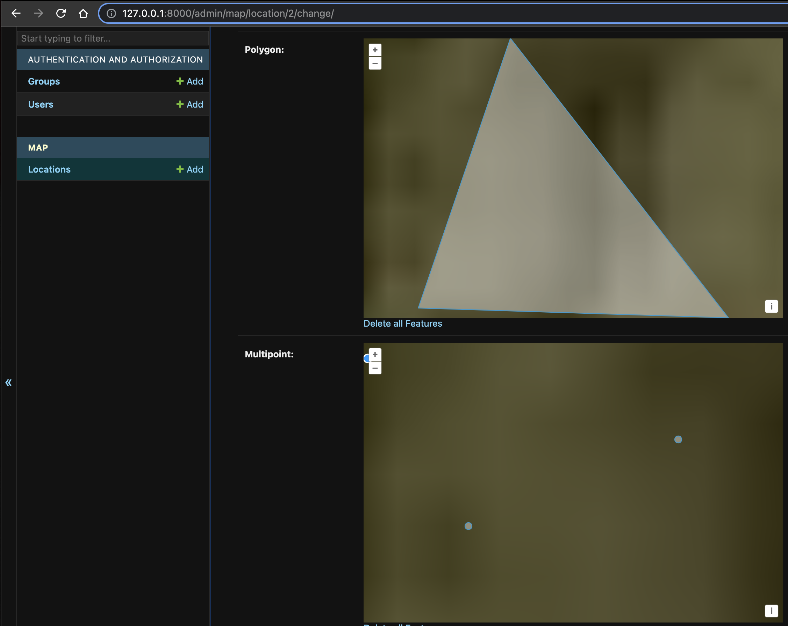
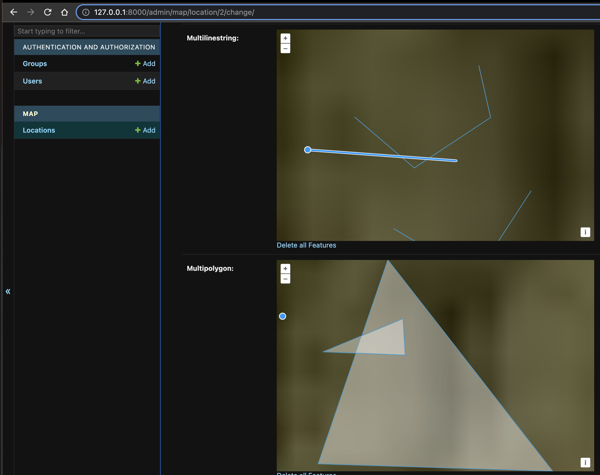

# geo-django
Running Django with PostGIS and geolocation libraries 


## Ovewview

#### Django

Django is a high-level web framework for building web applications in Python. It was first released
in 2005 and has since become one of the most popular Python web frameworks, known for its flexibility,
scalability, and ease of use.

Django provides a set of tools and libraries that help developers create web applications quickly and
efficiently. It follows the Model-View-Controller (MVC) architectural pattern, but instead of using
separate components for the Model, View, and Controller, Django uses a slightly different approach
called Model-View-Template (MVT). In the MVT pattern, the Template component is responsible for
rendering the HTML pages, while the Model component defines the database structure, and the View
component handles the logic of the application.

Django is designed to be modular, which means that developers can use only the parts of the
framework that they need, and they can add new functionality by using third-party packages
or building their own reusable components. Django also includes built-in support for common
web development tasks such as authentication, URL routing, form handling, and database migration.

#### PostGIS

PostGIS is an open-source extension for the PostgreSQL database management system that adds support
for geospatial data. It allows users to store and manipulate spatial data such as points, lines,
and polygons, and perform geospatial queries and analyses.

PostGIS provides a wide range of geospatial functions and operators that can be used to perform
geometric and topological operations on spatial data, such as distance calculations, intersection
tests, buffering, and simplification. It also supports various spatial data formats, such as
Well-Known Text (WKT), Well-Known Binary (WKB), and GeoJSON, and can import and export data
to and from other geospatial formats such as Shapefiles.

PostGIS is widely used in a variety of applications that deal with geospatial data, such as
geographic information systems (GIS), location-based services, and web mapping. It is a
powerful tool for managing and analyzing geospatial data within the context of a relational
database, providing a scalable and flexible solution for storing and processing large
amounts of spatial data.

#### Geo Django

GeoDjango is a geospatial web framework that extends Django, the popular Python web
framework, with geospatial capabilities. It provides a set of tools and libraries
that allow developers to build web applications that deal with geospatial data and
perform geospatial queries and analyses.

GeoDjango includes the PostGIS extension for PostgreSQL, which allows users to
store and manipulate geospatial data using a relational database. It also provides
a set of Python APIs and utilities for working with geospatial data, such as the
GeoDjango model fields for storing geometries and the GeoQuerySet API for
performing spatial queries.

#### Leaflet

Leaflet is a popular open-source JavaScript library for building interactive maps
and map-based applications. It provides a simple and flexible API for creating maps
and adding various layers, markers, and popups to them.

When used with Django, Leaflet can be integrated into web applications to display
and manipulate geospatial data. Django provides a set of tools and libraries for
working with geospatial data, such as GeoDjango and the Django ORM, which can be
used to store, retrieve, and manipulate geospatial data. Leaflet can then be used
to render this geospatial data on a web page as an interactive map.

One way to use Leaflet in Django is to include the Leaflet JavaScript library in
your Django project and use it to render a map on a web page. You can then use
the Django ORM or a third-party package such as GeoDjango to retrieve geospatial
data from a database and add it as markers or layers on the map.

There are also several third-party packages available for integrating Leaflet
with Django, such as django-leaflet and django-geojson, which provide additional
tools and utilities for working with geospatial data and Leaflet maps in Django.

#### Django Rest Framework

Django REST framework is a powerful toolkit for building Web APIs in Django. It
provides a set of tools and utilities for building RESTful APIs, including
serialization, authentication, pagination, and content negotiation.

With Django REST framework, developers can easily create APIs that communicate
with other applications or services over the web. It supports both JSON and XML
data formats, and provides a consistent and intuitive API for performing CRUD
(Create, Retrieve, Update, Delete) operations on resources.

### GDAL

GDAL (Geospatial Data Abstraction Library) is an open-source library for reading,
writing, and manipulating geospatial data. It provides a set of tools and APIs
for working with various raster and vector geospatial data formats, such as GeoTIFF,
NetCDF, HDF, and Shapefile.

### GeoTIFF

A GeoTIFF file is a standard file format for storing georeferenced raster data.
It is a type of TIFF (Tagged Image File Format) file that includes additional
geospatial metadata such as projection, coordinate system, and other spatial
reference information.

A GeoTIFF file consists of one or more raster bands, where each band represents
a different spectral channel or data layer. Each pixel in the raster is associated
with a set of geographic coordinates that define its location on the Earth's surface.
The geospatial metadata in the file allows software applications to interpret
and manipulate the raster data in a spatial context, such as displaying it on
a map or performing spatial analysis.

GeoTIFF files are widely used in various fields such as remote sensing, GIS
(Geographic Information Systems), and cartography, and can contain a wide
range of data types such as elevation data, satellite imagery, and land
cover data. They are supported by many software applications and libraries,
including GDAL (Geospatial Data Abstraction Library), QGIS, ArcGIS, and others.

#### SRID

A SRID (Spatial Reference ID) is a unique identifier that defines the coordinate
system and projection of a geometry. It specifies the reference system in which
the coordinates of the geometry are measured, and allows you to transform coordinates
between different reference systems.

#### EWKT

EWKT (Extended Well-Known Text) is a text representation of a geometry that includes
the SRID information. It is used to specify the spatial reference system of a geometry
in text format.

## References

- [PostGIS](https://postgis.net/)
- [Django Postgres](https://docs.djangoproject.com/en/4.2/ref/databases/)
- [Psycopg2](https://pypi.org/project/psycopg2/)
- [GDAL](https://gdal.org/)
- [PostGIS Docker tags](https://registry.hub.docker.com/r/postgis/postgis/)

## Architecture

|File|Description|
|---|---|
|[docker-compose.yml](docker-compose.yml)|Docker compose file.|
|[manage.py](manage.py)|Django utility to manage the project.|
|[cat/settings.py](cat/settings.py)|Application settings file.|
|[cat/urls.py](cat/urls.py)|Routes settings file.|
|[cat/wsgi.py](cat/wsgi.py)|WSGI settings file.|
|[core/apps.py](core/apps.py)|Core application configuration file.|
|[core/fixtures/user.py](core/fixtures/user.py)|User sample data.|
|[map/admin.py](map/admin.py)|Map application admin file.|
|[map/models.py](map/models.py)|Map application models file.|
|[map/apps.py](map/apps.py)|Map application configuration file.|
|[map/tests.py](map/tests.py)|Map application tests file.|
|[map/views.py](map/views.py)|Map application views.|
|[map/fixtures/location.py](core/fixtures/location.py)|Location sample data.|

## Instructions

#### Starting a PostgreSQL database using Docker
```bash
docker-compose up
```

#### Installing all the dependencies
```bash
virtualenv -p "python3" .env
source .env/bin/activate
pip3 install -r requirements.txt
```

#### Applying migrations
```bash
python3 manage.py migrate --noinput
```

#### Load some test data
```bash
python manage.py loaddata core/fixtures/user.json
python manage.py loaddata map/fixtures/location.json
```

#### Starting the Django application locally
```bash
python3 manage.py runserver
```
```bash
Django version 4.2, using settings 'cat.settings'
Starting development server at http://127.0.0.1:8000/
Quit the server with CONTROL-C
```

#### Create an admin
```bash
python3 manage.py shell
```
```bash
from django.contrib.auth.models import User
user = User()
user.username = 'test'
user.email = 'test@test.com'
user.set_password('test')
user.is_superuser = True
user.is_staff = True
user.save()
```

#### Login with username and password at [http://127.0.0.1:8000/admin/login/?next=/admin/](http://127.0.0.1:8000/admin/login/?next=/admin/)



#### Go to the Django admin



#### Check the Geospatial fields





#### In the Django shell, create a location object with a Point field:
````bash
>>> from django.contrib.gis.geos import Point
>>> from map.models import Location
>>> point = Point(0, 0)
>>> location = Location.objects.create(name='My Location', point=point)
>>> location.point.x
0.0
>>> location.point.y
0.0
>>> location.point.z
>>> location.point.srid
4326
>>> location.point.ewkt
'SRID=4326;POINT (0 0)'
>>> location.point.hex
b'010100000000000000000000000000000000000000'
>>> location.point.distance(Point(3, 4, 2))
5.0
>>> location.point.buffer(location.point.distance(Point(3, 4, 2)))
<Polygon object at 0x1176f5510>
>>> location.point.equals(Point(0, 0, 0))
True
````

#### In the Django shell, find locations within a certain distance of a point:
````bash
>>> from django.contrib.gis.measure import D
>>> from django.contrib.gis.geos import Point
>>> from map.models import Location
>>> locations = Location.objects.filter(point__distance_lte=(Point(1, 1), D(m=10000000000)))
>>> locations.count()
5
```

#### In the Django shell, find locations that intersect a polygon:
```bash
>>> from django.contrib.gis.geos import Polygon
>>> polygon = Polygon(((0, 0), (0, 10), (10, 10), (10, 0), (0, 0)))
>>> locations = Location.objects.filter(polygon__intersects=polygon)
>>> locations.count()
1
```

#### In the Django shell, get the centroid of a polygon
```bash
>>> from django.contrib.gis.geos import Polygon
>>> polygon = Polygon(((0, 0), (0, 10), (10, 10), (10, 0), (0, 0)))
>>> polygon.centroid.tuple
(5.0, 5.0)
```
